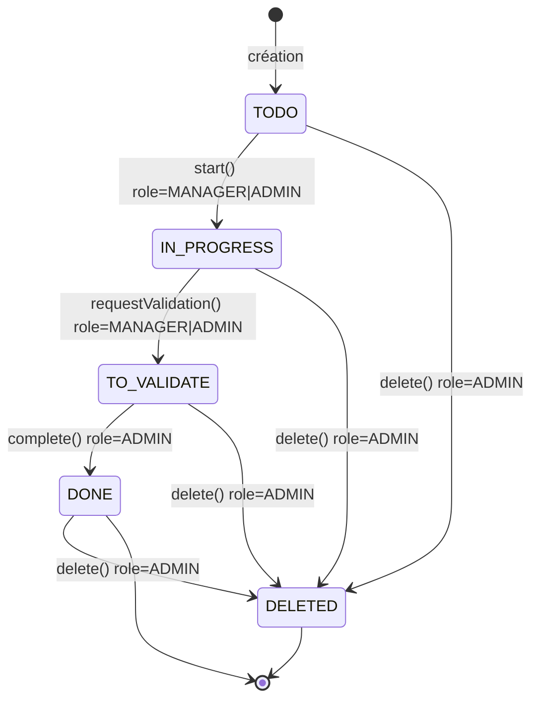

# Document de travail – Qualineo cas pratique

---

# Besoins fonctionnels

## Gestion des rôles

Trois rôles distincts :

* Utilisateur (User)
* Gestionnaire (Manager)
* Administrateur (Administrator)

---

## Organisation

* La création d’un compte crée automatiquement :

  * Une organisation
  * Un utilisateur avec rôle Administrateur

* Un administrateur peut :

  * Inviter / créer un utilisateur dans son organisation
  * Lui attribuer un rôle

---

## Plan d’action

* Un administrateur peut créer un plan d’action
* Un plan d’action contient plusieurs actions

---

## Action

Une action contient :

* Un titre
* Une description
* Un état :

  * À faire
  * En cours
  * À valider
  * Terminé

---

## Workflow des états

Manager :

* TODO → IN_PROGRESS
* IN_PROGRESS → TO_VALIDATE

Admin :

* TO_VALIDATE → DONE
* Suppression d’action

### Diagramme d’état (Action)



---

## Visibilité

Tous les utilisateurs peuvent :

* Voir la liste des actions
* Voir le détail d’une action

---

# Hypothèses et Solutions

## Multi-tenant

* Toutes les entités métier sont scopées via `organization_id`
* Aucun accès cross-organisation

## Simplifications

* Mono-organisation par utilisateur
* Rôle unique par utilisateur

## Workflow

* États figés : TODO → IN_PROGRESS → TO_VALIDATE → DONE
* Machine à états côté backend

## RBAC hiérarchique

ADMIN ⊇ MANAGER ⊇ USER

## Invariant critique

≥ 1 administrateur actif par organisation

## Concurrence

* Optimistic locking sur status
* 409 en cas de conflit

## Suppression

* Hard delete (scope test)

---

# Modélisation DDD

## Aggregate Roots

| Aggregate Root | Responsabilité                      |
| -------------- | ----------------------------------- |
| Organization   | Gouvernance des rôles et isolation  |
| ActionPlan     | Regroupement d’actions              |
| Action         | Workflow et logique métier centrale |

---

# Domain Errors et Règles Transactionnelles

## Principes

* Les erreurs métier sont levées dans le Domain
* L’Application les mappe vers HTTP
* L’Infrastructure ne contient pas de logique métier

---

## Domain Errors – Organization

### LastAdminInvariantViolation

Violation de l’invariant ≥ 1 admin actif.
→ 409 Conflict

### CrossOrganizationAccess

Accès à une ressource d’une autre organisation.
→ 403 Forbidden

### InvalidRoleAssignment

Rôle invalide.
→ 400 Bad Request

---

## Domain Errors – ActionPlan

### UnauthorizedActionPlanCreation

Création par non-admin.
→ 403 Forbidden

### OrganizationMismatch

Plan rattaché à une autre organisation.
→ 400 Bad Request

---

## Domain Errors – Action

### InvalidActionStatus

Status invalide.
→ 400 Bad Request

### InvalidStateTransition

Transition non autorisée par la state machine.
→ 400 Bad Request

### UnauthorizedTransition

Transition interdite par rôle.
→ 403 Forbidden

### ConcurrencyConflict

expectedStatus ≠ currentStatus.
→ 409 Conflict

### UnauthorizedActionDeletion

Suppression par non-admin.
→ 403 Forbidden

### ActionPlanOrganizationMismatch

Incohérence organization_id Action/Plan.
→ 400 Bad Request

---

# Règles Transactionnelles

## Atomicité

Chaque commande est exécutée dans une transaction unique.

## Frontière d’agrégat

Une transaction modifie un seul Aggregate Root.

## Ordre de validation

Auth → Scope org → RBAC → Invariants → Persistence

## Optimistic Locking

UPDATE conditionnel sur status.

Si 0 rows → ConcurrencyConflict.

## Intégrité multi-tenant

* organization_id obligatoire
* FK composite Action → ActionPlan

---

# Garanties globales

Le système garantit :

* Isolation multi-tenant stricte
* Respect du RBAC
* Intégrité du workflow
* Protection contre conflits concurrents
* Aucune élévation de privilège via API

---

# Améliorations futures

* Statut du plan
* Multi-organisation par utilisateur
* Workflow configurable
* Audit complet
* Soft delete

---

# Structure du monorepo (NX)

## Vue d’ensemble

```
.
├── apps/
│   ├── backend/
│   │   └── src/
│   │       ├── main.ts
│   │       ├── app.module.ts
│   │       └── bootstrap/
│   └── frontend/
│       └── src/
├── packages/
│   ├── backend/
│   │   ├── action-management/
│   │   │   ├── src/
│   │   │   │   ├── action-management.module.ts
│   │   │   │   ├── domain/
│   │   │   │   ├── application/
│   │   │   │   ├── infrastructure/
│   │   │   │   └── presentation/
│   │   │   └── project.json
│   │   ├── shared/
│   │   │   ├── src/
│   │   │   │   ├── auth/
│   │   │   │   ├── rbac/
│   │   │   │   ├── tenancy/
│   │   │   │   └── http/
│   │   │   └── project.json
│   │   └── persistence/
│   │       ├── src/
│   │       │   ├── typeorm/
│   │       │   ├── repositories/
│   │       │   └── mappers/
│   │       └── project.json
│   ├── contracts/ (optionnel)
│   └── api-client/ (optionnel)
└── tools/
```

---

## Principes d’architecture

### Backend comme shell

`apps/backend` contient uniquement :

* Bootstrap NestJS
* Configuration globale (pipes, filters, interceptors)
* Composition des modules

Aucune logique métier ne réside dans `apps/backend`.

---

### Bounded Context : action-management

Le dossier `packages/backend/action-management` contient :

* Domain (agrégats, value objects, erreurs métier)
* Application (commands, queries, ports)
* Infrastructure (implémentations spécifiques au domaine)
* Presentation (controllers HTTP, DTOs)

Ce module constitue le cœur métier du système.

---

### Shared Backend

`packages/backend/shared` regroupe les préoccupations transverses :

* Authentification
* RBAC
* Tenancy (scope organisation)
* Filtres HTTP et mapping des erreurs

---

### Persistence

`packages/backend/persistence` contient :

* Client base de données (Prisma ou TypeORM)
* Implémentations des repositories
* Mappers DB ↔ Domain
* Seed éventuel

---

## Règles de dépendances

* Domain ne dépend de rien
* Application dépend de Domain
* Infrastructure dépend de Domain et Application
* Presentation dépend de Application
* apps/backend dépend de tous les modules (composition)

Cette structure garantit une séparation claire des responsabilités et respecte une approche DDD adaptée à un test technique senior.

yarn nx g @nx/nest:library shared --directory=packages --buildable=false
yarn nx g @nx/nest:library iam --directory=packages --buildable=false
yarn nx g @nx/nest:library organizations --directory=packages --buildable=false
yarn nx g @nx/nest:library users --directory=packages --buildable=false
yarn nx g @nx/nest:library action-plans --directory=packages --buildable=false
yarn nx g @nx/nest:library actions --directory=packages --buildable=false

## Modèle de données

```mermaidv2
erDiagram
  ORGANIZATIONS ||--o{ USERS : has
  ORGANIZATIONS ||--o{ ACTION_PLANS : owns
  ACTION_PLANS  ||--o{ ACTIONS : contains
  ORGANIZATIONS ||--o{ ACTIONS : scopes

  ORGANIZATIONS {
    uuid id PK
    text name
    timestamptz created_at
    timestamptz updated_at
  }

  USERS {
    uuid id PK
    uuid organization_id FK
    text email "UNIQUE"
    text password_hash
    text role "ENUM: USER|MANAGER|ADMIN"
    timestamptz created_at
    timestamptz updated_at
  }

  ACTION_PLANS {
    uuid id PK
    uuid organization_id FK
    uuid created_by_user_id FK
    text title
    text description
    timestamptz created_at
    timestamptz updated_at
  }

  ACTIONS {
    uuid id PK
    uuid action_plan_id FK
    uuid organization_id FK
    uuid created_by_user_id FK
    text title
    text description
    text state "ENUM: TODO|IN_PROGRESS|TO_VALIDATE|DONE"
    int version "optimistic lock"
    timestamptz created_at
    timestamptz updated_at
  }
```